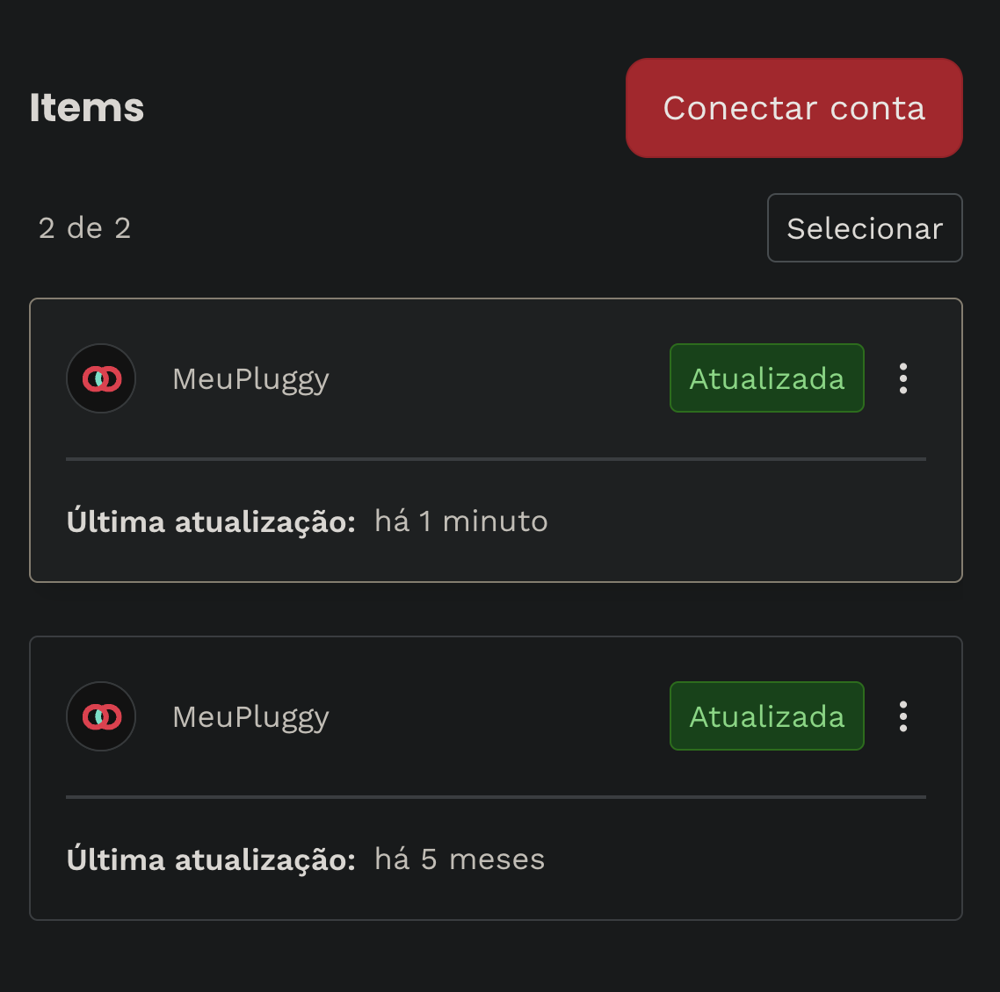

Brazil Finance Automation
=========================
Manda transações de bancos brasileiros (Nubank, Itaú, etc.) para o YNAB.

Estou muito grato a [Felipe de Morais](https://github.com/lipemorais), quem criou [o base](https://github.com/lipemorais/financas-automatizadas/) por este repo.

Prerequisites
-------------
You must go through [all the steps here](https://github.com/pluggyai/meu-pluggy?tab=readme-ov-file#connecting-your-bank-account-to-meupluggy) to create a MyPluggy account, a developer portal account, and link them together!

⚠️ **IMPORTANT:** If you're hooking up multiple banks, you need to create multiple items in the Pluggy Dashboard for your Application, like this:



Use
---
### Running locally
This repo is [set up with VSCode's devcontainers](https://code.visualstudio.com/docs/devcontainers/containers).

The easiest way to get going with it is to:

1. Install [Docker](https://www.docker.com/)
1. Install [VSCode](https://code.visualstudio.com/)
1. Install the [Dev Containers extension](https://marketplace.visualstudio.com/items?itemName=ms-vscode-remote.remote-containers)
1. Open the repo in VSCode
1. Select "Reopen in container" when the popup appears, "Folder contains a Dev Container configuration file. Reopen folder to develop in a container"

The first time you start the dev container, the `.env.example` will be copied to a `.env`. You'll get prompted with an "❗ACTION" to fill in your credentials in the `.env` file.

From there, you can run the sync using:

```
make run
```

Tests can be run with:

```
make test
```

### Running Every Day
[Like this](https://github.com/mieubrisse/brazilian-finance-automation/actions/workflows/sync-to-ynab.yml)
1. Fork this repo
1. Update the repository's secrets in Github to provide the values for the environment variables you're going to consume (e.g. `ACCOUNT_0_YNAB_ID`)
1. Modify the `.github/workflows/sync-to-ynab.yml` file to pass in the environment variables you specifically use, based on the contents of your `.env` file
1. Enable Github Actions on the repo
1. Test the action by clicking "Run"
